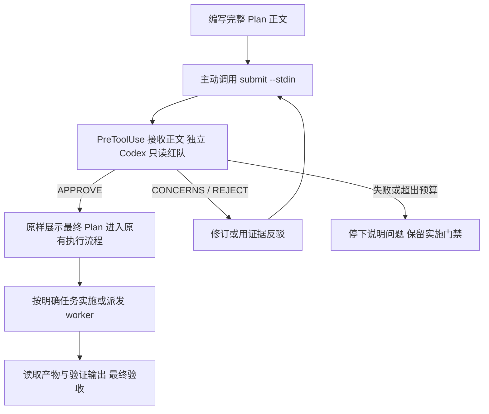

# Codex Plan Review

在 Codex 的 Plan 模式完成实施计划后，主会话主动传入完整正文，由独立 Codex 只读进程做红队评审，再展示最终计划并进入原有的 Plan→执行流程。

模型与供应商配置沿用当前 Codex 配置。技术评审通过不会增加固定批准口令，也不会替用户授予新的执行权限。

本项目是受 [Claude Code plan-review](https://github.com/binbinah/cc-plugins/tree/main/plugins/plan-review) 思路启发的独立实现，按 Codex 的事件与工具协议编写，不复用 Claude 的 `ExitPlanMode` 或 `subagent_type` 参数。

## 安装

要求 Python 3.11+、macOS 或 Linux，以及支持 plugins、command hooks 和子 agent 的本地 Codex。已验证的具体版本与范围见 [验证记录](docs/validation.md)。运行 hook 不需要 pip 安装或第三方 Python 依赖。

```sh
codex plugin marketplace add binbinah/codex-plan-review
codex plugin add plan-review@codex-plan-review
```

重新打开 Codex 会话，在 `/hooks` 中审阅并信任这个插件的 6 个 hook。安装和启用插件不会自动授予 hook 信任。桌面端也可在插件与 Hooks 设置中完成相同操作。

在项目中使用正常的 Plan 模式制定计划。主会话在输出最终 `<proposed_plan>...</proposed_plan>` 之前，使用插件注入的 `submit --stdin` 命令提交完整 Markdown 正文。通过后展示同一份计划。启动上下文与 skill 会提供具体命令。

```text
进入 Plan 模式，为这个需求制定完整计划，输出最终计划前，使用 plan-review 提交完整正文做红队评审。
```

评审状态：

| 状态 | 后续行为 |
|---|---|
| APPROVE | 继续 Codex 原有 Plan→执行流程；保留已给出的授权 |
| CONCERNS / REJECT | 主会话根据回传 JSON 修订或用证据反驳，重新提交完整正文 |
| 进程失败、超时、无效结果 | 停止本轮，不记为批准；实施工具保持受限，只读调查可继续 |
| 达到轮次上限 | 停止自动循环，向用户说明未解决事项；不自动跳过评审 |

只在正式计划提交后建立实施门禁。普通问答、调查和未提交计划的会话不会被全局锁定。

## 机械任务派发

Codex 支持原生子 agent 分派。插件包含 `dispatch-work` skill，供用户或适用项目规则明确要求分派时使用：

```text
计划通过后，用 dispatch-work 把已经明确的机械实现派给 worker。
给它精确文件范围、目标行为和验收命令。主会话等待回传后亲自核验。
```

| 角色 | 职责 |
|---|---|
| 主会话 | 需求、架构、根因判断、计划、任务拆分和最终验收 |
| 红队 | 独立只读评审；对问题给出证据、影响与修复建议 |
| worker | 在限定文件范围内执行已明确的任务；遇到新决策或缺失信息返回主会话 |
| 主会话或验证者 | 读取实际产物，核对命令输出与验收判据 |
| hook 状态机 | 记录版本和评审结果，检查实施前状态；不代替用户授权 |

默认使用宿主可用的 worker/分派工具，继承模型配置。不同 Codex 界面的工具参数可能不同，skill 要求使用实际 schema。可选角色样例见 [mechanical-worker.toml](examples/agents/mechanical-worker.toml)，需要时由用户放入项目 `.codex/agents/`；安装插件不会修改全局代理配置。

## 工作机制



- `SessionStart`：注入主动提交的确切命令，恢复已有评审状态。
- `UserPromptSubmit`：保存有界、脱敏的需求与后续约束，不依赖 transcript 格式。
- `Stop`：检查已有评审状态；宿主提供最终正文时核对哈希。它不再调用红队或读取会话记录。
- `PreToolUse`：识别标准提交命令和字面 heredoc，接收完整正文，运行红队并返回 JSON；未通过时拦截实施。支持 Codex 的 `apply_patch`、shell、MCP 和分派输入。
- `SubagentStart`：给匹配的 worker 补充机械执行职责。
- `SubagentStop`：记录回传线索并提醒主会话核验，记录本身不表示验收通过。

提交命令无需填写 session id：hook 使用宿主提供的当前会话定位。红队在 hook 的宿主进程运行，实际 shell 命令改写为输出结果 JSON，因此只读 Plan sandbox 不需要写插件状态目录。正文中的 shell 表达式不会执行。

计划使用 SHA-256 绑定，状态使用进程锁和原子写入。仓库或项目规则在批准后、首次实施前变化会要求重新评审。并发提交同一计划只启动一个引擎；旧评审不能覆盖更新后的状态。

红队通过 `codex exec -s read-only --ephemeral` 运行，禁用递归 hooks、plugins、apps、子 agent、网页搜索和读取到的本地 MCP 配置。模型、供应商与鉴权配置保留。结果受 JSON Schema 约束，并再次校验 verdict 与问题严重程度一致。

## 配置与排障

配置通过运行环境提供，不把 API key 放入本项目：

| 环境变量 | 默认值 | 作用 |
|---|---|---|
| `PLAN_REVIEW_CODEX_BIN` | `codex` | 红队 Codex 可执行文件 |
| `PLAN_REVIEW_TIMEOUT_SECONDS` | `240` | 每次评审超时，允许 1–270 秒；提交 hook 总预算 300 秒 |
| `PLAN_REVIEW_MAX_ROUNDS` | `3` | 自动评审轮次，允许 1–10 |
| `PLAN_REVIEW_DATA_DIR` | 插件 `PLUGIN_DATA/plan-review` | 私有状态目录；无宿主变量时使用 XDG state 目录 |
| `PLAN_REVIEW_ENABLED` | 开启 | `0` 显式关闭工作流；不会改变 Codex 权限 |

从已安装插件的真实目录调用辅助命令，不要任意挑选旧缓存版本：

```sh
python3 <plugin-root>/scripts/review.py doctor
python3 <plugin-root>/scripts/review.py status --session <actual-session-id> --cwd <repo>
python3 <plugin-root>/scripts/review.py review --stdin --session <actual-session-id> --cwd <repo> <<'PLAN_BODY'
完整 Markdown 计划正文
PLAN_BODY
```

`review` 返回码 0 表示技术批准，3 表示仍未放行，2 表示输入或运行错误。独立 `review` 命令也支持 `--plan <file>`。在原生 Plan 中，主会话使用自动注入的 `submit --stdin`，用户无需手工运行以上命令。

原生会话中，主会话可调用注入的同一脚本加 `status`、`retry` 或 `reset`，无需猜 session id。用户要求重新评审时，`retry` 保留意见并重置轮次预算，随后必须重提完整正文；用户取消计划时，`reset` 清除当前门禁。独立终端调用使用 `--session ... --cwd ...` 参数。两者都不改变 Codex sandbox 或执行授权，也不要求发送哈希批准口令。

## 能力边界

- 使用 `.codex-plugin/plugin.json` 兼容格式。本次测试发现便携根 `plugin.json` 格式的技能可以加载，但当前 Codex 实现会跳过其 hooks，因此没有同时放一个会覆盖兼容入口的根 manifest。
- 评审输入来自主会话主动提交的完整正文，不读取 transcript。当前原生 Plan 的 Stop 输入正文可能为空，因此提交与最终展示的正文一致依靠 skill 契约；有正文时 hook 额外检查哈希。真实测试独立核对了这两份正文。
- 没有完成主动提交的普通会话不会被锁定；插件被禁用或模型未遵循提交约定时，不能保证评审发生。
- command hooks 必须存在于运行环境并获信任；不宣称普通 Chat 或所有云编排表面都支持本插件。
- 这是工作流护栏。宿主 hook 报错、被禁用、未获信任或部分工具绕开 hook 路径时，不形成完整安全边界。
- 红队 MCP 隔离支持字母、数字、下划线与连字符组成的服务器名；其它名称启动前明确报错，不静默保留工具。
- shell 的只读判断是保守的命令分类。未知 shell 与 MCP 调用在待评审状态下可能被拒绝；普通会话不受此限制。
- 原生权限仍由宿主控制。子 agent 可继承主会话运行时权限，角色提示词不形成权限隔离。
- 当前没有强制“主会话不能改任何源码”、任务 DAG 执行器、跨供应商 fallback，或“发生一次读取就自动验收”的机制。
- 评审会把脱敏计划、需求、项目规则、仓库状态和既有意见交给当前配置的模型供应商；只读红队仍可读取仓库文件。运行状态目录包含敏感项目内容，不应上传或提交。

## 开发与验证

```sh
python3 -m unittest discover -s tests -v
python3 -m compileall -q plugins/plan-review/scripts tests
```

真实测试会使用当前模型供应商，产生实际调用：

```sh
python3 tests/live_codex.py --output artifacts/live-codex.json
```

测试使用私有临时 `CODEX_HOME`、测试仓库和插件安装；不修改全局配置。测试通过宿主的配置 API，仅为自己审阅过的插件 hook 在临时配置中记录信任；不使用 trust bypass。原始日志与临时配置不会进入 git；公开验证记录只保留脱敏结论。

参考：[官方 Hooks](https://learn.chatgpt.com/docs/hooks)、[官方 Subagents](https://learn.chatgpt.com/docs/agent-configuration/subagents)、[官方插件打包](https://developers.openai.com/plugins/build/plugins)。
